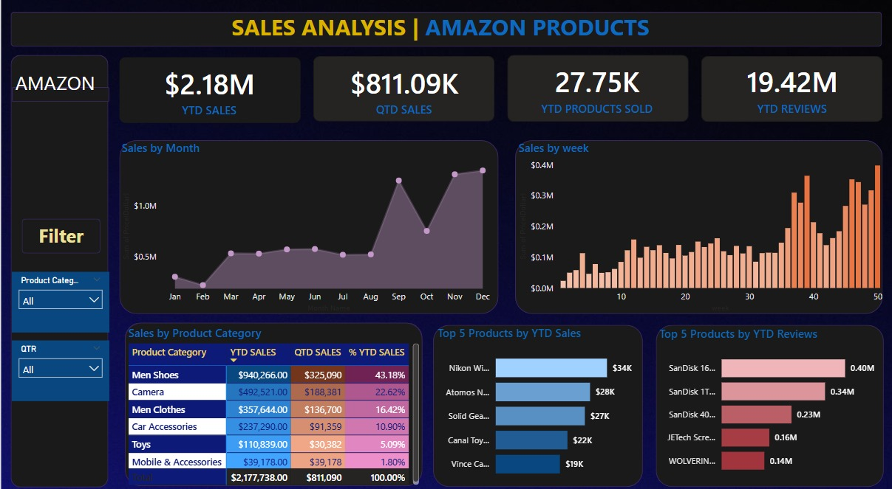

# 🛒 Amazon Product Sales Analysis - Power BI Project

This project presents a Power BI dashboard that analyzes sales and product performance for Amazon products. It provides a comprehensive overview of sales trends, top-performing products, and category-wise insights to help business stakeholders make data-driven decisions.

---

## 📷 Project Screenshot:

---

## 📂 Files Included:

- `amazon_sales_dashboard.pbix` — Power BI dashboard file  
- `amazon_sales_data.xlsx` — Raw dataset (hypothetical)  
- `amazon.jpg` — Screenshot of final dashboard  

---

## 🎯 Business Objective:

The objective of this project is to analyze Amazon product sales data to:

- Track Year-To-Date (YTD) and Quarter-To-Date (QTD) sales performance  
- Identify top-performing product categories and individual products  
- Monitor trends in product reviews and customer engagement  
- Assist stakeholders in making informed business decisions based on sales insights  

---

## 📊 Key Metrics (KPIs):

- **YTD Sales:** Total sales achieved year-to-date  
- **QTD Sales:** Total sales achieved quarter-to-date  
- **YTD Products Sold:** Total quantity of products sold year-to-date  
- **YTD Reviews:** Total number of product reviews year-to-date  
- **Sales by Month:** Visual trend of monthly sales  
- **Sales by Week:** Weekly sales performance  
- **Sales by Product Category:** Category-wise sales contribution  
- **Top 5 Products by YTD Sales:** Best-selling products  
- **Top 5 Products by YTD Reviews:** Most reviewed products  

---

## 🔍 Key Insights:

- Highest sales observed in the months of **November and December**, indicating strong seasonal demand  
- **Men's Shoes** is the top-performing product category contributing over **43%** of total YTD sales  
- Significant increase in sales observed in the last quarter  
- **Nikon, Atomos, Solid Gear** products emerged as top sellers  
- **SanDisk products** dominate in terms of product reviews, indicating high customer engagement  
- Weekly sales trend shows consistent growth towards the end of the year  

---

## 🛠️ Tools & Technologies Used:

- **Power BI** for Data Visualization & Dashboard Development  
- **Microsoft Excel** for Data Cleaning and Preprocessing  
- **DAX** for calculated measures and KPIs  

---

## 📝 Optional Extended Description:

This project provides an interactive Power BI dashboard designed to analyze Amazon product sales and performance across different categories and timeframes. 

The analysis focuses on both sales volume and customer engagement, enabling stakeholders to track progress, identify trends, and make data-driven decisions for better product positioning and marketing strategies.

### Target Audience:

- Amazon Sellers  
- Business Analysts  
- Marketing Teams  
- E-commerce Consultants  
- Anyone interested in Amazon product performance tracking  

